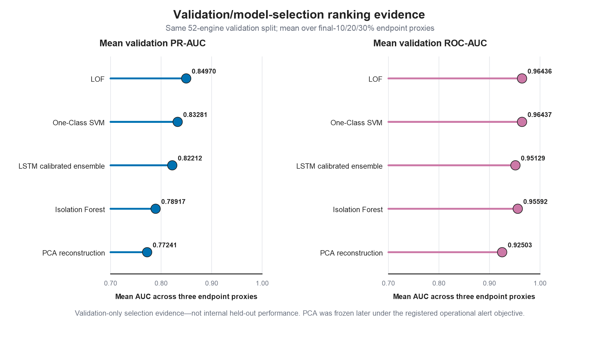
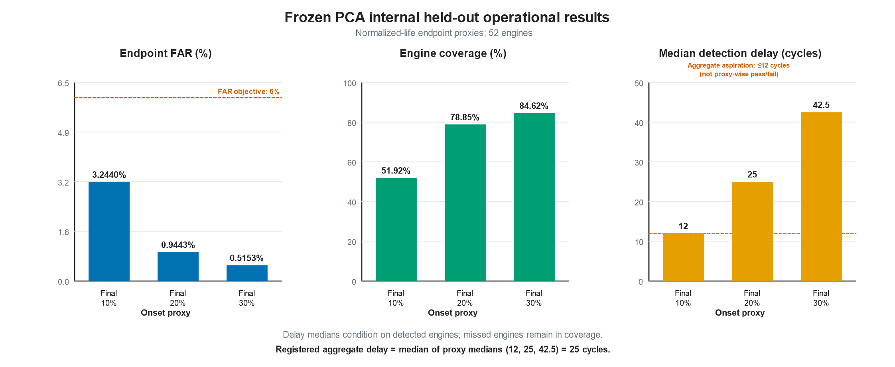
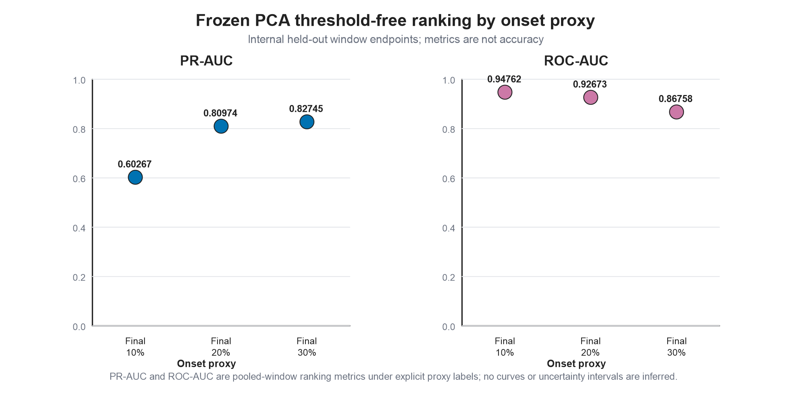

# Context-Aware Reconstruction-Based Anomaly Alerting for Multi-Regime Turbofan Degradation

**[AUTHOR 1]**, **[AUTHOR 2]**

[DEPARTMENT], [INSTITUTION], [CITY, COUNTRY]

Corresponding author: [CORRESPONDING EMAIL]

## Abstract

Aircraft-engine predictive maintenance requires separating sensor changes caused by operating context from changes associated with degradation, while also limiting false alerts. This study evaluates a healthy-only, condition-aware anomaly-alerting pipeline on the six-condition NASA C-MAPSS FD002 benchmark using an engine-disjoint split. Before accessing the internal held-out partition, the complete alerting configuration was locked at a project-defined governance checkpoint, termed Gate 4 in the project protocol. This pre-held-out policy freeze covered preprocessing, feature construction, detector selection, score calibration, operating-mode thresholds, exponentially weighted moving-average (EWMA) smoothing, persistence, state-reset behavior, onset proxies, event semantics, and evaluation metrics. The frozen primary uses six-cluster operating-context normalization, 30-cycle windows, 63 summary features, principal-component-analysis (PCA) reconstruction error, a training-only empirical-CDF calibration, six per-mode 99.5th-percentile thresholds, EWMA with $\alpha=0.20$, and eight-endpoint persistence. On 52 internal held-out engines, endpoint false-alert rates were 3.2440%, 0.9443%, and 0.5153% under final-10%, final-20%, and final-30% normalized-life onset proxies; corresponding coverage was 51.92%, 78.85%, and 84.62%, with median delays of 12, 25, and 42.5 cycles. All three proxies met the registered 6% false-alert objective, but the aggregate median-of-proxy-medians delay was 25 cycles and did not meet the 12-cycle aspiration. Review of 20 deeply extracted papers found no Category A protocol-equivalent comparator. The labels are evaluation proxies rather than observed physical fault onsets, results are internal rather than external, uncertainty intervals were not registered, and the study does not establish field performance or physical fault localization.

**Keywords:** turbofan anomaly detection; condition-aware preprocessing; one-class learning; PCA reconstruction; persistent alerts; C-MAPSS FD002; engine-disjoint evaluation

## 1. Introduction

Predictive maintenance systems seek evidence of deterioration early enough to support inspection, planning, or intervention without creating an unacceptable burden of false alerts. That objective is difficult when the monitored asset legitimately moves among operating conditions. A change in pressure, temperature, or rotational response can arise from load and environmental context, from degradation, or from measurement noise. A detector that does not distinguish these sources may rank operating transitions as anomalous, while an excessively conservative detector may remain quiet until little useful warning remains.

The C-MAPSS simulator and its run-to-failure trajectories provide a controlled setting for studying this ambiguity [@core001]. FD002 is particularly relevant because it combines six operating conditions with one simulated fault mode. At the same time, C-MAPSS benchmarking requires careful protocol interpretation: the run-to-failure training trajectories and the separately supplied truncated official test trajectories support different experimental designs, and numerical results are not comparable when splits, labels, targets, or aggregation differ [@core003; @core004]. This paper therefore treats FD002 as a simulated multi-context anomaly-alerting study, not as evidence of deployed aircraft performance.

Anomaly alerting also differs from remaining-useful-life (RUL) regression. RUL studies commonly predict a terminal life estimate and report last-cycle regression errors or the NASA scoring function. Here, the system produces a score at every eligible window endpoint, converts that score into a persistent alert state, groups active endpoints into events, and evaluates false-positive endpoints, engine coverage, and delay relative to explicitly defined onset proxies. The absence of observed physical onset annotations makes a proxy necessary, but it also means that no single proxy can be treated as ground truth. We consequently report final-10%, final-20%, and final-30% normalized-life endpoint proxies together.

Four operational research questions organize the study:

1. Can condition-aware preprocessing improve validation discrimination relative to global scaling?
2. Can a frozen reconstruction-based policy keep the proxy-healthy endpoint false-positive rate below 6% across the three registered onset proxies?
3. What coverage-delay trade-off appears as the assumed onset changes?
4. Can PCA reconstruction error provide faithful model-level sensor contributions without being misrepresented as physical fault localization?

These questions are operational design questions, not retrospectively formulated null hypotheses. The study performs no formal null-hypothesis significance testing. Its contributions are correspondingly bounded: an engine-disjoint leakage-control protocol; six-context normalization; a comparison of classical and LSTM reconstruction approaches; an explicit calibration-threshold-smoothing-persistence chain; the pre-held-out policy freeze; proxy-sensitivity reporting; exact PCA reconstruction-error attribution; and a reproducible evidence and claims-governance trail. The work does not propose a new PCA, K-Means, or EWMA algorithm, does not establish causal diagnosis, and does not claim literature superiority, production readiness, or external validation.

## 2. Related Work

### 2.1 Reconstruction-based health modelling

Sequence reconstruction is a recurring approach to multivariate anomaly detection. LSTM encoder-decoder methods learn nominal temporal structure and use reconstruction behavior as an anomaly score [@core005]. Related prognostic work maps LSTM reconstruction error into a continuous health index and then estimates RUL through trajectory matching [@core006]. Healthy-only or semi-supervised autoencoder studies have also evaluated turbofan anomaly labels under engine-separated designs, although subsets, onset definitions, and point-classification metrics differ from the present protocol [@core007]. More recent physics-inspired temporal-consistency methods similarly use reconstruction signals but apply different subsets, labels, and supervised threshold choices [@core012]. Real-engine LSTM-autoencoder studies provide methodological context for reconstruction-based fault detection, yet their hardware, fault labels, split rules, and reported measures cannot be transferred directly to FD002 endpoint alerting [@core051].

Two papers are the closest Category B partial comparators in the manuscript-grade evidence set. A key-point FD002 study identifies degradation transitions and supports RUL planning, but its task, onset construction, split identity, and event semantics do not match the current study [@core010]. The strongest partial comparator uses unsupervised LSTM autoencoders on FD001--FD004 and reports FD002 precision, recall, specificity, and F1 under a within-trajectory 85%/5%/10% construction [@core013]. It shares FD002 and early-fault intent, but random healthy windows from the same trajectory can cross development roles, the onset proxy differs, and its adaptive threshold and five-window persistence do not reproduce this policy. Specificity therefore cannot be converted into the endpoint false-alert rate defined here.

### 2.2 Operating-condition handling

Condition handling is central when nominal behavior varies with operating context. Residual-learning work on real jet-engine test data removes operating effects before LSTM reconstruction [@core014], while self-adaptive normalization aligns operating-dependent vibration spectra before anomaly scoring [@core017]. FD002/FD004 RUL studies also use multi-condition normalization, but their supervised last-cycle targets remain distinct from continuous anomaly alerts [@core018]. Regime-aware baselining with self-organizing maps and normalizing neural networks further demonstrates the methodological value of learning context-dependent baselines [@core021]. These works motivate condition awareness; they do not establish that a particular six-cluster representation corresponds to six causal physical regimes.

### 2.3 Onsets, thresholds, persistence, and evaluation

One-class change-point methods illustrate how calibration and onset definitions can be coupled, but model-derived change points are not equivalent to normalized-life proxies [@core008]. Work integrating change-point monitoring with RUL estimation under variable conditions likewise uses official test trajectories for a different terminal regression objective [@core009]. Outside turbofan studies, nonparametric dynamic thresholding and grouped anomaly sequences show how smoothing and event construction can materially affect the practical behavior of a score [@core026]. Broad evaluations of multivariate time-series anomaly detection emphasize that error scoring, thresholding, and event-aware metrics influence conclusions [@core034], while rigorous-evaluation research warns that point adjustment and weak baselines can inflate apparent performance [@core036]. Sensor-wise reconstruction residuals have also been used as observational clues in flight-data autoencoders [@core055], providing a precedent for model-level decomposition but not for causal root-cause inference.

The literature review used 20 legal full texts that received manuscript-grade extraction and recorded 43 precisely located numerical values. Strict comparability categories A/B/C/D contained 0/2/11/7 papers. No directly protocol-equivalent published comparator was identified in the manuscript-grade core literature set. Table 4 therefore preserves native tasks and metrics and marks project-compatible FAR as not reported and not comparable rather than constructing a misleading league table.

<!-- latex-table: tables/table_04_literature_comparison.tex -->
**Table 4. Focused literature comparison.** Selection was based on methodological relevance and comparability, not favorable results. NR means not reported. “Not comparable” indicates mismatched data, task, split, onset labels, denominator, aggregation, or alert semantics.

| Study | Citation | Category | Dataset/task | Split and labels | Reported native metrics | Project-compatible FAR | Exact evidence | Decisive caveat |
|---|---|---|---|---|---|---|---|---|
| LIT-010 | core010 | B | NASA C-MAPSS / FD002; key-point anomaly/degradation analysis and RUL planning | FD002 lifecycle analysis; the paper's 'test set' identity is not explicit enough to equate with NASA official test; labels/onset: two key points obtained by self-convolution, halving, and derivatives; not mapped to this project's normalized-life proxies | NR | NR—not comparable | Full methodology/result/limitation sections; source SHA-256 bf0d6aa9698b435f58ced8186844acbcc4ad38e767c430a2353b64f7219a3b44 | FD002 aligns, but task, labels, split identity, threshold/event semantics, and metrics do not. |
| LIT-013 | core013 | B | NASA C-MAPSS / FD001, FD002, FD003, FD004; early fault detection | within-trajectory 85% baseline, 5% exclusion, 10% degraded test; random healthy windows form validation; labels/onset: final 10% of each trajectory is anomalous; middle 5% is excluded | FD002: precision 0.374; recall 0.799; specificity 0.982; F1 0.510; anomaly fraction 0.013 | NR—not comparable | LIT-013-V01 p.9 Table 3; LIT-013-V02 p.9 Table 3; LIT-013-V03 p.9 Table 3; LIT-013-V04 p.9 Table 3; LIT-013-V05 p.9 Table 3; LIT-013-V06 p.9 Table 3; LIT-013-V07 p.9 Table 3; LIT-013-V08 p.9 Table 3; LIT-013-V09 p.9 Table 3; LIT-013-V10 p.9 Table 3; LIT-013-V11 p.9 Table 3; LIT-013-V12 p.9 Table 3; LIT-013-V13 p.9 Table 3; LIT-013-V14 p.9 Table 3; LIT-013-V15 p.9 Table 3; LIT-013-V16 p.9 Table 3; LIT-013-V17 p.9 Table 3; LIT-013-V18 p.9 Table 3; LIT-013-V19 p.9 Table 3; LIT-013-V20 p.9 Table 3 | Same FD002 and anomaly intent, but non-engine-disjoint within-trajectory split, different proxy, threshold, persistence, and point metrics prohibit direct comparison. |
| LIT-007 | core007 | C | NASA C-MAPSS / FD004; anomaly detection | 220 engines train, 20 validation, 19 test from FD004 run-to-failure trajectories; labels/onset: last 5% treated as anomalous; intervening cycles excluded | FD004: F1 0.892; precision 0.896; recall 0.724 | NR—not comparable | LIT-007-V01 p.47 Table VI; LIT-007-V02 p.47 Table VI; LIT-007-V03 p.47 Table VI | Engine-disjoint anomaly evaluation is useful context, but FD004 has two faults and labels/metrics/alert semantics differ. |
| LIT-008 | core008 | C | NASA C-MAPSS / FD004; change-point detection | 20 randomly selected engines train; remaining 229 test; labels/onset: transition region benchmarked against WTTE-RNN uncertainty behavior | NR | NR—not comparable | Full methodology/result/limitation sections; source SHA-256 df0f01f87243a490395efc5e71f57563cda3db4dac1f886324f4c514e5b721de | Change-point objective and model-derived reference are not equivalent to this project's proxy endpoint alerts. |
| LIT-009 | core009 | C | NASA C-MAPSS / FD001-FD004; emphasis FD002/FD004; change-point detection integrated with RUL estimation | training engines support change-point model and RUL training; official test engines evaluate RUL; labels/onset: earlier of persistent T2 and Q control-limit breaches | NR | NR—not comparable | Full methodology/result/limitation sections; source SHA-256 4da3c61605c235ed643363cf79cc7e2e63b61e5665ba702f84e195cb1a62ffbf | Uses FD002 official test, but evaluates last-cycle RUL regression rather than anomaly alerts over all observed cycles. |
| LIT-012 | core012 | C | NASA C-MAPSS / FD001 and FD003; anomaly detection | 80/20 engine-disjoint outer split; 90/10 training-engine development split; labels/onset: final 40% of trajectory | FD001/FD003: accuracy, precision, recall, F1, and correct-detection rate; values at LIT-012-V01–V10 | NR—not comparable | LIT-012-V01 p.7 Table II; LIT-012-V02 p.7 Table II; LIT-012-V03 p.7 Table II; LIT-012-V04 p.7 Table II; LIT-012-V05 p.7 Table II; LIT-012-V06 p.7 Table II; LIT-012-V07 p.7 Table II; LIT-012-V08 p.7 Table II; LIT-012-V09 p.7 Table II; LIT-012-V10 p.7 Table II | Engine split is useful, but subset, 60/40 onset, threshold supervision, and point metrics differ. |
| LIT-018 | core018 | C | NASA C-MAPSS / FD001-FD004; FD002/FD004 emphasized; remaining useful life prediction | canonical train/test split; experiments repeated 15 times; labels/onset: piecewise RUL knee is imposed/selected rather than observed fault onset | NR | NR—not comparable | Full methodology/result/limitation sections; source SHA-256 dee9760c4e0b28f5a53ddfcf7271ac76a1a872b4436887f00773c736df224fc5 | FD002 aligns, but supervised last-cycle RUL RMSE/score is a different target and evaluation unit. |
| LIT-006 | core006 | C | NASA C-MAPSS turbofan plus milling and industrial pulverizer / single-condition 100-train/100-test C-MAPSS set (FD001-equivalent); health-index construction and RUL estimation | 80 training engines fit, 20 training engines tune via truncation; 100 official test engines evaluate; labels/onset: continuous reconstruction-error health index; no binary onset | FD001-equivalent: timeliness 256; accuracy 0.67; MAE 10 cycles; MSE 164 cycles²; MAPE1 0.18; MAPE2 0.05; FPR 0.13; FNR 0.20 | NR—not comparable | LIT-006-V01 p.7 Table 1; LIT-006-V02 p.7 Table 1; LIT-006-V03 p.7 Table 1; LIT-006-V04 p.7 Table 1; LIT-006-V05 p.7 Table 1; LIT-006-V06 p.7 Table 1; LIT-006-V07 p.7 Table 1; LIT-006-V08 p.7 Table 1 | Official-test RUL results are contextual and cannot be compared with FD002 proxy anomaly metrics. |
| This study—Final 10% | project authority | Internal held-out; no Category A literature comparator | NASA C-MAPSS FD002; anomaly-alert evaluation | 52 engine-disjoint internal held-out engines; Final 10% endpoint proxy | FAR 32.4397111029502/1,000 (3.24397111029502%); coverage 51.9230769230769%; delay 12 cycles; PR-AUC 0.60267050756248719; ROC-AUC 0.94762058057118681 | 32.4397111029502/1,000; 3.24397111029502% | configs/evaluation/fd002-confirmatory-results-v1.json: primary_endpoint_results[normalized_life_last_10pct_endpoint] | Proxy-labelled internal held-out result; not official NASA-test or observed physical onset. |
| This study—Final 20% | project authority | Internal held-out; no Category A literature comparator | NASA C-MAPSS FD002; anomaly-alert evaluation | 52 engine-disjoint internal held-out engines; Final 20% endpoint proxy | FAR 9.44326990838619/1,000 (0.944326990838619%); coverage 78.8461538461538%; delay 25 cycles; PR-AUC 0.80974370926945527; ROC-AUC 0.92673191171288805 | 9.44326990838619/1,000; 0.944326990838619% | configs/evaluation/fd002-confirmatory-results-v1.json: primary_endpoint_results[normalized_life_last_20pct_endpoint] | Proxy-labelled internal held-out result; not official NASA-test or observed physical onset. |
| This study—Final 30% | project authority | Internal held-out; no Category A literature comparator | NASA C-MAPSS FD002; anomaly-alert evaluation | 52 engine-disjoint internal held-out engines; Final 30% endpoint proxy | FAR 5.15292553191489/1,000 (0.515292553191489%); coverage 84.6153846153846%; delay 42.5 cycles; PR-AUC 0.82745190397469459; ROC-AUC 0.86757612061640033 | 5.15292553191489/1,000; 0.515292553191489% | configs/evaluation/fd002-confirmatory-results-v1.json: primary_endpoint_results[normalized_life_last_30pct_endpoint] | Proxy-labelled internal held-out result; not official NASA-test or observed physical onset. |
<!-- end-latex-table -->

## 3. Dataset and Experimental Protocol

### 3.1 FD002 study population

Each FD002 cycle row contains an engine identifier, a cycle index, three operating-setting variables, and 21 sensor variables, for 26 columns in total. The source used here contains 260 complete run-to-failure trajectories under six operating conditions and one simulated fault mode. Because the benchmark does not supply an observed physical degradation-onset label for each cycle, the study separates an early-life fitting assumption from later evaluation proxies.

The deterministic split assigns whole engines, not windows, to 156 training, 52 validation, and 52 internal held-out engines. Maximum-cycle rank quintiles support stratification, the primary split seed is 42, and a secondary seed is 43. There is zero engine overlap. The training partition contains 32,107 cycle rows and 27,583 length-30 windows; validation contains 10,873 rows and 9,365 windows; internal held-out contains 10,779 rows and 9,271 windows. Overlapping windows within an engine remain correlated and are not treated as independent engines.

<!-- latex-table: tables/table_01_dataset_protocol_summary.tex -->
**Table 1. Dataset and experimental-protocol summary.** The manifest name `test` denotes the internal held-out partition, not NASA's separately supplied official test files.

| Partition | Manifest name | Engines | Cycle rows | Length-30 windows | Role | Fitting allowed | Evidence status |
|---|---|---|---|---|---|---|---|
| Training | train | 156 | 32107 | 27583 | Fit preprocessing, detectors, calibrators, and training-reference thresholds | Yes—only registered training populations | Development/fitting |
| Validation | validation | 52 | 10873 | 9365 | Select K, models, and alert policy under registered proxies | No learned-state fitting | Validation/model selection |
| Internal held-out | test | 52 | 10779 | 9271 | First valid frozen confirmatory evaluation | No refit, recalibration, reselection, or fusion | Completed internal held-out |
| Official NASA test | external/deferred | NR | NR | NR | Separately preregistered future external evaluation | Outside completed study | Not accessed; deferred |
<!-- end-latex-table -->

### 3.2 Fitting assumptions and onset proxies

Eligible healthy-training windows end no later than $\lfloor0.30L_e\rfloor$, where $L_e$ is the observed maximum cycle of training engine $e$. This rule yields 5,037 fitting windows across 156 engines. Windows after that boundary are unlabeled; the protocol does not declare them known anomalies.

For an engine of observed length $L_e$ and a final-life fraction $q\in\{0.10,0.20,0.30\}$, endpoint proxy onset is

$$
o_e(q)=\left\lfloor L_e(1-q)\right\rfloor+1.
$$

Endpoints before $o_e(q)$ are proxy-healthy, and endpoints at or after it are proxy-positive. These are sensitivity assumptions, not observed physical fault times. The frozen model is identical for all three proxies; only the evaluation labels and resulting populations change.

### 3.3 Selection, freeze, and held-out access

Training fits learned components. Validation selects the operating-context representation, detector candidates, and alert policy. The pre-held-out policy freeze then prevents internal held-out information from influencing model or policy selection. The held-out partition was accessed for one valid frozen run, and the result was accepted regardless of metric values. No refit, recalibration, threshold change, candidate search, online adaptation, or fusion was permitted after access. NASA's separate truncated official test files remained outside the completed study.

{#fig:protocol width=95%}

## 4. Proposed Methodology

### 4.1 Condition-aware preprocessing

The global control pipeline (P0) fits one sensor scaler using eligible early-life training rows. The selected condition-aware pipeline (P1/K=6) first standardizes the three operating settings using all training-engine rows and fits K-Means with $K=6$ to those settings. It then assigns each row an operating-context cluster and fits a sensor scaler for each mode using only eligible early-life training rows; a global eligible-training scaler is available as a sparse-mode fallback. Validation and held-out rows are transformed without refitting. K=6 was selected over K=4 and K=8 using validation evidence, including silhouette 0.9970369527, mean stability adjusted Rand index 1.0, minimum validation mode fraction 0.1469695576, and zero fallback modes. Cluster identifiers describe learned operating context and are not causal physical labels.

### 4.2 Engine-local windows and model inputs

The transformed sensor stream is divided into 30-consecutive-cycle windows with stride one, separately within each engine. Windows cannot cross engine boundaries. An exact join on `(engine, end_cycle)` assigns the operating mode observed at the endpoint cycle; the implementation does not use a majority-window vote or infer mode from sensor values.

The LSTM autoencoder consumes the full $30\times21$ sequence. Classical detectors instead use an ordered 63-element summary vector. For window $i$, sensor $j$, and $t=1,\ldots,30$,

$$
\bar{x}_{ij}=\frac{1}{30}\sum_{t=1}^{30}x_{itj},
$$

$$
s_{ij}=\sqrt{\frac{1}{30}\sum_{t=1}^{30}\left(x_{itj}-\bar{x}_{ij}\right)^2},
$$

and

$$
\Delta x_{ij}=x_{i,30,j}-x_{i,1,j}.
$$

The standard deviation uses `ddof=0`. The final ordering is 21 means, 21 population standard deviations, and 21 endpoint-minus-start differences, each in registered sensor order. Thus PCA neither flattens nor reconstructs a 630-element sensor-time grid.

### 4.3 Candidate score sources and PCA selection

Validation compared PCA, Local Outlier Factor (LOF), One-Class SVM, and Isolation Forest under global and condition-aware preprocessing. The deep comparator was a one-layer LSTM autoencoder with hidden dimension 64 and latent dimension 16. Seeds 43--45 reached best epochs 47, 54, and 59; the preregistered median rule locked all three final refits at 54 epochs. Each seed used a training-only empirical CDF, and the ensemble score was the arithmetic mean of window-ID-aligned calibrated scores.

LOF led the validation ranking comparison, not PCA. Mean PR-AUC/ROC-AUC values were 0.84969513/0.96436313 for LOF, 0.83280767/0.96437111 for One-Class SVM, 0.82212053/0.95128915 for the LSTM ensemble, 0.78916934/0.95592104 for Isolation Forest, and 0.77240729/0.92503450 for PCA. A later registered operational selection evaluated 1,280 candidate policies under five proxies. After enforcing a worst-proxy ceiling of 60 false-positive endpoints per 1,000 proxy-healthy endpoints, the lexicographic objective prioritized minimum and mean coverage before false-alert events, affected engines, delay, lead, and candidate identifier. PCA won that operational objective. Consequently, PCA was frozen as primary while the three-seed LSTM remained an unfused nonprimary comparator.

{#fig:validation width=95%}

### 4.4 PCA reconstruction score and calibration

The PCA candidate uses `n_components=0.90`, meaning that the validation-selected configuration retains enough components to explain 90% of eligible-training variance. A feature `StandardScaler` and PCA are fitted on the 5,037 eligible 63-feature training vectors. If $\mathbf{z}_i\in\mathbb{R}^{63}$ is the standardized vector and $\hat{\mathbf{z}}_i$ its PCA reconstruction, the raw anomaly score is

$$
a_i=\frac{1}{63}\sum_{k=1}^{63}\left(z_{ik}-\hat{z}_{ik}\right)^2.
$$

The empirical-CDF calibrator stores sorted eligible-training scores $\{a_n^{\mathrm{train}}\}_{n=1}^{N}$ and maps a score to

$$
c_i=\frac{1}{N}\sum_{n=1}^{N}\mathbb{I}\!\left(a_n^{\mathrm{train}}\leq a_i\right).
$$

This is a right-sided training-reference percentile, not a probability that an engine has failed.

### 4.5 Frozen temporal alert policy

Six mode-specific thresholds are training-derived 99.5th percentiles of calibrated eligible-training scores using NumPy's `method="higher"`. At runtime, the calibrated score is smoothed before comparison. For a consecutive segment,

$$
m_i=\alpha c_i+(1-\alpha)m_{i-1},\qquad \alpha=0.20,
$$

with the first score initializing the segment, $m_1=c_1$. The current endpoint mode selects threshold $\tau_{r_i}$, and a violation occurs only when

$$
v_i=\mathbb{I}(m_i>\tau_{r_i}).
$$

The comparison is strict. A counter increments on consecutive violations and resets to zero otherwise; the alert becomes active on the eighth consecutive violation, without backdating. State resets when the engine changes or endpoint cycles are not consecutive, but it does not reset merely because the mode changes. Contiguous active endpoints within one engine and consecutive end cycles form an event. Online recalibration is disabled.

{#fig:architecture width=95%}

<!-- latex-table: tables/table_02_frozen_primary_policy.tex -->
**Table 2. Frozen primary policy and verified settings.** Full-precision thresholds remain in the machine-readable table source.

| Component | Frozen setting | Fit/derivation boundary | Authority |
|---|---|---|---|
| Engine split | 156 train / 52 validation / 52 internal held-out; whole-engine separation; seed 42 | Split manifest only | configs/splits/fd002-primary-v1.json: split |
| Healthy-training eligibility | Window end cycle ≤ floor(0.30 × engine maximum cycle); 5,037 eligible windows | Training engines only; ineligible windows remain unlabeled | baseline config: training_policy |
| P1/K=6 preprocessing | Scaled 3-setting K-Means (K=6); per-mode sensor scaling with global healthy fallback | Operating scaler/K-Means: all training rows; sensor scalers: early-life training rows | preprocessing.RegimeSensorPreprocessor.fit |
| Window and endpoint mode | 30 cycles × 21 sensors, stride 1; mode from exact (engine, end_cycle) join | Transform/derivation only | confirmatory protocol: preprocessing; metadata.assign_endpoint_operating_modes |
| PCA representation | 63 ordered features: 21 means, 21 population SDs (ddof=0), 21 endpoint-minus-start differences | Summary reduction fits no state | windows.summary_features; inference protocol: pca_score_and_attribution |
| PCA model and raw score | n_components=0.90; mean squared reconstruction residual across standardized 63-feature space | Feature scaler and PCA fitted on eligible training features | selected_models.csv p1_k6/pca; classical._raw_scores_scaled |
| Calibration | Right-sided empirical CDF: count(training score ≤ score) / n | Eligible training scores only; frozen transform on validation/held-out | calibration.EmpiricalCDFCalibrator |
| Per-mode threshold | q=0.995, NumPy method='higher'; mode 0: 0.9974190986698431; mode 1: 0.9908675799086758; mode 2: 0.9948381973396864; mode 3: 0.9922572960095295; mode 4: 0.996624975183641; mode 5: 0.9932499503672821 | Six training-reference thresholds, frozen before held-out access | confirmatory protocol: primary.thresholds |
| Runtime state | Calibrated score → EWMA α=0.20 → strict current-mode threshold comparison → persistence 8 | No online recalibration; alert begins on eighth consecutive violation without backdating | persistence.apply_alert_policy; confirmatory protocol: primary |
| State reset and events | Reset at engine boundary or endpoint gap, not mode change; contiguous active endpoints form events | Deterministic state machine | alert protocol: state_contract; alerts.extract_alert_events |
| PCA sensor contribution | Per sensor: mean/std/slope squared residuals summed and divided by 63; contributions sum to raw PCA MSE | Local normalized-feature-space model fidelity only | pca_attribution.attribute_pca_reconstruction |
| Comparator and fusion boundary | Three-seed calibrated LSTM score mean is an unfused comparator; PCA–LSTM fusion not evaluated | Comparator policy frozen separately; primary remains PCA | confirmatory protocol: comparator; alert result: fusion_evaluated=false |
<!-- end-latex-table -->

### 4.6 PCA sensor contribution

For sensor $j$, the local contribution groups that sensor's mean, standard-deviation, and endpoint-change residuals:

$$
g_{ij}=\frac{(z_{ij}^{\mu}-\hat z_{ij}^{\mu})^2+(z_{ij}^{\sigma}-\hat z_{ij}^{\sigma})^2+(z_{ij}^{\Delta}-\hat z_{ij}^{\Delta})^2}{63}.
$$

The 21 nonnegative contributions satisfy $\sum_{j=1}^{21}g_{ij}=a_i$ to registered numerical tolerance. This completeness property makes the output faithful to the PCA score for one window. It remains an observational decomposition in normalized feature space: it is not SHAP, does not identify a physical root cause, and does not establish fault localization or causality. The implemented delivery interface is hash-checked and batch, transform-only; streaming state serialization remains pending.

## 5. Evaluation Metrics

Ranking and alert metrics answer different questions. PR-AUC and ROC-AUC assess threshold-free ordering of pooled window endpoints within one proxy. They are not accuracy and do not show how the frozen threshold, smoothing, and persistence behave. Operational metrics are computed after the complete alert state machine.

For one proxy, endpoint false-alert rate is

$$
\mathrm{FAR}=\frac{\text{false-positive active endpoints}}{\text{proxy-healthy endpoints}},
$$

with FAR/1,000 equal to $1{,}000\times\mathrm{FAR}$ and FAR percentage equal to $100\times\mathrm{FAR}$. It is not the percentage of healthy engines with an alert, the number of false-alert events per engine, false alarms per flight hour, or a field-deployment rate. No operating-hour denominator exists in the implementation.

Engine detection coverage is the number of engines with at least one event whose start cycle is at or after proxy onset, divided by 52. An event that starts before onset and crosses it is not a valid post-onset detection. The missed-engine rate is the complement of coverage. For each detected engine, first-alert delay is the first valid event start minus proxy onset, measured in cycles. Proxy-specific delay is the median across detected engines only; missed engines have no finite delay and remain visible through coverage. Persistence delay is included. The registered aggregate delay is the median of the three proxy-specific medians, not a pooled median across engines or proxies.

Average precision provides PR-AUC, and ROC-AUC uses the same proxy labels and calibrated scores. Both pool included window endpoints. Because the windows overlap, no uncertainty interpretation may treat them as independent engines. No engine-bootstrap interval or other registered uncertainty interval is available.

## 6. Performance Analysis and Results

### 6.1 Validation-stage evidence

Figure 5 separates model selection from confirmation. LOF and One-Class SVM led mean validation PR-AUC, while the LSTM calibrated ensemble ranked between those methods and Isolation Forest. PCA ranked fifth on this threshold-free comparison. Yet the alert-policy study exposed why ranking alone is insufficient: the selected LOF and Isolation Forest policies could achieve zero false alerts by producing zero engine detections. The registered operational objective rewarded feasible FAR together with coverage and event behavior, under which PCA became the primary policy. This distinction prevents the inaccurate statement that PCA had the highest validation performance.

### 6.2 Frozen internal held-out result

Table 3 reports the complete primary result. The final-10% proxy produced 265 false-positive active endpoints among 8,169 proxy-healthy endpoints, or 32.440 per 1,000 (3.2440%). It detected 27 of 52 engines (51.92%), with median delay 12 cycles among detected engines. Final-20% produced 67/7,095 false-positive endpoints, 9.443 per 1,000 (0.9443%), detected 41/52 engines (78.85%), and had median delay 25 cycles. Final-30% produced 31/6,016 false-positive endpoints, 5.153 per 1,000 (0.5153%), detected 44/52 engines (84.62%), and had median delay 42.5 cycles.

<!-- latex-table: tables/table_03_confirmatory_results.tex -->
**Table 3. Frozen PCA internal held-out results.** Delay medians condition on detected engines; misses remain in coverage. Display values are rounded, while the CSV retains source precision.

| Endpoint proxy | FP/healthy endpoints | FAR/1,000 | FAR (%) | Detected/engines | Coverage (%) | Median delay (cycles) | PR-AUC | ROC-AUC |
|---|---|---|---|---|---|---|---|---|
| Final 10% | 265/8169 | 32.440 | 3.2440 | 27/52 | 51.92 | 12 | 0.60267 | 0.94762 |
| Final 20% | 67/7095 | 9.443 | 0.9443 | 41/52 | 78.85 | 25 | 0.80974 | 0.92673 |
| Final 30% | 31/6016 | 5.153 | 0.5153 | 44/52 | 84.62 | 42.5 | 0.82745 | 0.86758 |
<!-- end-latex-table -->

All three endpoint FAR percentages were below the registered 6% objective. The delay outcome was less favorable: only final-10% had a 12-cycle proxy-specific median, and the registered aggregate was $\operatorname{median}(12,25,42.5)=25$ cycles. The aggregate therefore missed the 12-cycle aspiration. The aspiration was registered for the aggregate result; it is not a separate pass/fail requirement imposed retrospectively on every proxy.

{#fig:operational width=95%}

### 6.3 Proxy sensitivity and ranking metrics

As the assumed onset moves from the final 10% to the final 30% of life, measured FAR falls, coverage rises, and median delay rises. PR-AUC increases from 0.60267 to 0.82745, whereas ROC-AUC falls from 0.94762 to 0.86758. These changes do not show that one onset is physically correct. The proxy modifies class prevalence, the duration designated proxy-healthy, and the interval in which a post-onset event can qualify. The model and alert policy were not retrained for any proxy. Reporting all three assumptions makes this sensitivity explicit and discourages selection of a single favorable headline.

{#fig:ranking width=90%}

### 6.4 Literature comparability

The present FAR is reported because it is central to the registered operational objective and its denominator is explicit. Compatible FAR is unavailable for the reviewed literature because published tasks use different subsets, engine/window splits, onset labels, decision rules, or aggregation. In particular, specificity is a point-classification quantity whose negative class is defined by another study; subtracting it from one does not reproduce false-positive active endpoints divided by this study's proxy-healthy endpoints after EWMA and persistence. RUL RMSE and NASA Score are similarly contextual regression measures, not alert metrics.

LIT-013 is the strongest Category B partial comparator because it uses FD002, healthy-only LSTM reconstruction, a final-life anomaly assumption, an adaptive threshold, and persistence [@core013]. It remains Category B because its within-trajectory partition can place windows from the same engine in different roles, its final-10%/excluded-middle construction differs, and its point precision/recall/specificity/F1 do not match endpoint, event, and engine metrics. No numerical superiority or first-ever claim follows from the absence of a Category A comparator.

### 6.5 Reading the evidence by decision layer

The results are most useful when interpreted at three separate layers. The first is representation: validation evidence supports condition-aware scaling over the global control for the matched classical configurations, and it supports a six-cluster representation over the registered alternatives. The second is score-source selection: threshold-free validation ranking favored LOF, whereas the later registered operational objective selected PCA after feasibility and engine coverage were considered. The third is deployment-policy behavior: calibration, mode-specific thresholds, smoothing, persistence, reset rules, and event grouping convert the PCA score into the held-out alerts summarized in Table 3. Evidence at one layer should not be promoted into a claim about another. In particular, a good PR-AUC does not by itself establish an acceptable alert rate, and meeting the endpoint FAR objective does not by itself establish adequate engine coverage or timely warning.

The denominator also determines the operational meaning. For final-10%, the proxy-healthy region extends farther into each trajectory than it does for final-20% or final-30%, creating more eligible healthy endpoints and more opportunities for a persistent alert to count as false. Moving onset earlier shortens that denominator and lengthens the post-onset interval in which an engine can be detected. The simultaneous decrease in FAR, increase in coverage, and increase in measured delay is therefore internally coherent: earlier assumed onset gives the policy more time to detect an engine, but it also measures the first valid alert from an earlier reference point. This pattern is a property of the frozen decisions evaluated under alternative labels, not evidence that the detector changes its behavior between proxies.

Several tempting summaries would discard important evidence. Reporting only the 0.5153% final-30% FAR would hide that its corresponding median delay is 42.5 cycles. Reporting only the 12-cycle final-10% delay would hide 25 missed engines and the highest observed FAR. Reporting ROC-AUC alone would omit the class-imbalance emphasis of PR-AUC and the stateful alert policy. The complete interpretation therefore keeps each proxy's FAR, coverage, conditional delay, PR-AUC, and ROC-AUC together and then separately states the registered cross-proxy objectives. That reporting discipline is central to the evidence claim: the study met its FAR objective, missed its aggregate delay aspiration, and has no registered scalar utility that combines those outcomes.

The result is also intentionally conditional on the frozen configuration. It does not estimate the best attainable FD002 performance, because held-out outcomes were not used to revise the policy. A different threshold, persistence count, smoothing coefficient, detector, or onset definition might produce another trade-off, but selecting it after seeing these 52 engines would answer a different and more optimistic question. Preserving the first valid frozen result makes the reported numbers an evaluation of a specified policy rather than a continuation of model development.

## 7. Discussion

Condition-aware normalization addresses a practical confound: nominal operating changes can dominate sensor differences that a global representation would otherwise treat as unusual. The validation record supports retaining P1/K=6 because all 12 matched classical parameter pairs improved mean validation PR-AUC relative to their global-scaling counterparts. This is a bounded validation finding, not a randomized causal estimate, and the six clusters should remain operating-context identifiers.

The study also demonstrates the difference between discrimination and alert behavior. LOF ranked best by mean validation PR-AUC, but a detector can rank proxy-positive endpoints well without yielding a useful thresholded policy under a false-alert constraint. Conversely, a zero-alert policy can appear perfect on false alerts while detecting no engines. The later objective jointly considered feasibility, coverage, events, delay, and lead; PCA's selection reflects that registered operational ordering. It does not imply universal PCA superiority.

The internal held-out result exposes a genuine trade-off rather than a single success score. The FAR objective was achieved under every proxy, but coverage ranged from 51.92% to 84.62%, and median delay ranged from 12 to 42.5 cycles. A reader cannot interpret delay independently of coverage because delay excludes missed engines. Nor can the 25-cycle aggregate be pooled into an engine-level statistic; it is exactly the median of three proxy medians. These conventions make the shortfall against the 12-cycle aspiration visible.

The LSTM ensemble was retained as a comparator because recurrent reconstruction is a plausible alternative and the three-seed mean improved stability within that model family. It did not lead the validation ranking, and the protocol froze it separately. Pairwise complementarity diagnostics did not evaluate a fused model, so no conclusion about PCA--LSTM fusion benefit is warranted. A future fusion study would require new registration and must leave this result unchanged.

PCA contributions provide a useful audit mechanism: each sensor's three summary-feature residuals add exactly to the raw score. This can show which normalized summaries made a window difficult for the PCA subspace to reconstruct. It cannot identify which physical component failed, distinguish cause from consequence, or establish that the highest-contributing sensor is defective. Domain validation and attribution-stability studies would be required before broader interpretation.

More generally, the work contributes a reproducible anomaly-alert evaluation pattern: separate training assumptions from evaluation proxies; keep engines disjoint; freeze the complete decision path before held-out access; report ranking and operational measures separately; retain negative results; and record exact denominators. These practices may be more transferable than any single FD002 number.

### 7.1 Implications for maintenance-oriented evaluation

An anomaly score is only one component of a maintenance-facing signal. A score can change at every endpoint, whereas a person or downstream process usually needs a stable indication that persists long enough to warrant attention. The frozen policy makes that conversion inspectable. Calibration puts training-reference scores on a common percentile scale; the mode-specific reference accommodates remaining context dependence; EWMA reduces endpoint-to-endpoint variation; and persistence requires repeated evidence. Each operation changes alert timing and false-alert opportunity. Reporting only the underlying PCA score would therefore describe a ranking model but not the evaluated system. Conversely, reporting only active alerts would conceal whether failures arise from poor ordering, calibration, or stateful policy choices.

The same separation helps interpret future extensions. If another detector replaces PCA while calibration and alert logic remain unchanged, differences can be attributed to the score source only under a newly controlled study. If persistence or thresholds change, the new result evaluates a different alert policy even when the PCA model is identical. If online adaptation is introduced, the training-only calibration boundary no longer describes the system. Treating these components as explicit contracts limits accidental comparisons between unlike systems and makes negative or mixed results easier to diagnose.

The three evaluation units also correspond to different questions. Endpoint FAR measures how often the active alert state occupies a region assumed healthy. Event counts would measure how frequently separate alert episodes begin. Engine coverage asks whether a trajectory ever receives a qualifying post-onset event. These quantities are related but not interchangeable: one long event can create many active endpoints, and multiple short events can affect event burden without changing whether an engine is covered. The present study registers endpoint FAR and engine coverage, while retaining event semantics for state construction. It does not claim to measure operator workload, because no maintenance workflow or intervention process was simulated.

Delay requires equally careful conditioning. A short median among detected engines can coexist with many misses, as the final-10% proxy demonstrates. Assigning an arbitrary large delay to missed engines would create a different estimand; dropping coverage would hide them. The paired presentation keeps the two consequences distinct. For a later decision analysis, an application owner could preregister costs for late detections, missed engines, and false-alert events, but no such cost model exists here. The manuscript therefore avoids collapsing the result into an unregistered utility score.

Finally, condition-aware normalization should not be mistaken for fault diagnosis. It attempts to remove repeatable operating-context variation before reconstruction scoring. That may make degradation-associated departures easier to rank, but it neither names a failed component nor proves that a residual is degradation-caused. The PCA contribution vector can support audit and hypothesis formation by showing which normalized summaries contributed to a score. Any maintenance action based on those contributions would require sensor semantics, engineering review, uncertainty assessment, and evidence beyond this simulation.

## 8. Limitations and Threats to Validity

The study uses one simulated C-MAPSS subset, one simulated fault mode, and one deterministic engine split. It does not establish split-to-split robustness, behavior on other subsets, or transfer to real aircraft. Overlapping windows are correlated, and no engine-bootstrap uncertainty intervals were registered. The results therefore should not be interpreted as population estimates with independent window-level replicates.

Onset validity is the principal construct limitation. Final-10%, final-20%, and final-30% boundaries are normalized-life assumptions, not observed physical degradation onsets. Proxy choice changes labels, prevalence, healthy denominators, coverage opportunity, and measured delay. Reporting sensitivity reduces but does not eliminate this uncertainty.

The evaluation is internal held-out rather than external. The separately supplied official NASA test trajectories were not accessed, and there is no external dataset or field-deployment result. The reported FAR is not false alarms per flight hour or per engine hour. There is no production monitoring, streaming state serialization, or evidence of safe operational thresholds under real usage.

Comparability is also limited. No Category A protocol-equivalent paper was found; Category B and C studies remain useful for methods and context but do not support direct rankings. No registered uncertainty interval supports significance language. The review deeply extracted 20 core papers, not every item in the broader 100-paper discovery matrix.

Finally, healthy-training and regime assumptions matter. Early-life windows may contain unobserved variation, K-Means clusters are not physical regimes, and per-mode scaling can be sensitive to the chosen representation. PCA attribution is non-causal model fidelity, not physical root-cause evidence. No PCA--LSTM fusion, online recalibration, failure analysis, or official-test generalization was evaluated.

Several additional validity boundaries follow from the experimental unit. Although the split is engine-disjoint, window-level PR-AUC and ROC-AUC pool many overlapping endpoints, and the manuscript does not attach an independent-replicate interpretation to those values. The single deterministic split preserves the registered first evaluation but cannot show how conclusions vary across alternative engine assignments. The alert thresholds are empirical training references; their apparent held-out behavior may change with a different population, sensor calibration, operating mix, or maintenance context. These are reasons for prospective replication, not reasons to retune on the completed held-out engines.

The literature review is deliberately focused rather than exhaustive. Legal full text and manuscript-grade extraction were available for 20 core papers, and the comparability categories describe that set. Publication terminology is inconsistent across anomaly detection, early fault detection, health-index construction, and RUL prediction, so another search strategy could identify additional contextual work. The absence of a Category A paper in this evidence set does not establish absence from the entire literature. It supports only the narrower conclusion that no directly protocol-equivalent comparator was found among the verified core manuscripts used for this paper.

## 9. Reproducibility and Data Governance

The project used a staged, project-specific governance workflow, but the scientific interpretation is straightforward: establish repository provenance; freeze an engine-disjoint split; select preprocessing and model candidates using training/validation only; lock the complete alert policy before held-out access; complete registered sensitivity analyses; and execute one internal held-out evaluation. Internal labels such as Gate 0 through Gate 7 are administrative milestones rather than standard anomaly-detection terminology. Only Gate 4 is mentioned here, once, to connect the public description of the pre-held-out policy freeze to the registered project record.

The freeze covered P1/K=6 preprocessing; 30-cycle, 21-sensor windows; the ordered 63-feature PCA representation; PCA reconstruction scoring; training-only empirical-CDF calibration; endpoint-cycle mode assignment; six per-mode 99.5th-percentile thresholds using `method="higher"`; EWMA $\alpha=0.20$; strict comparison; persistence eight; engine/gap resets; onset proxies; event and metric semantics; the LSTM comparator; and the no-fusion boundary. Its purpose was prevention of held-out feedback, not evidence that the configuration would succeed.

Every manuscript figure and table is generated from explicitly allowlisted aggregate authorities and implementation/configuration sources. The rendering workflow does not open scientific data, model artifacts, score traces, or per-engine files. SVG remains the editable vector authority, and 300-dpi PNG previews support broadly available LaTeX figure inclusion. Machine-readable tables preserve source precision; displayed values use declared rounding. Artifact provenance records input and output SHA-256 hashes, selectors, commands, and software versions.

The current repository status is: repository governance completed; split, preprocessing, LSTM refit, and alert policy frozen; registered proxy sensitivity and internal held-out evaluation completed; manuscript preparation in progress; official NASA-test evaluation deferred. A later batch inference and attribution implementation supersedes older documentation only for its narrow transform-only and non-causal decomposition claims. It does not add new held-out performance evidence or production status.

## 10. Conclusion and Future Work

This study evaluated a condition-aware, healthy-only reconstruction pipeline under whole-engine separation and a complete pre-held-out policy freeze. The primary PCA policy integrated training-fitted context normalization, 63-feature reconstruction error, empirical-CDF calibration, per-mode thresholds, EWMA smoothing, and persistence. Its internal held-out result must be read as a set: FAR was 3.2440%, 0.9443%, and 0.5153%; coverage was 51.92%, 78.85%, and 84.62%; and median delay was 12, 25, and 42.5 cycles across the final-10%, final-20%, and final-30% proxies. All FAR values met the 6% objective, while the 25-cycle median-of-proxy-medians delay missed the 12-cycle aspiration.

These findings support the value of explicit condition handling, leakage control, complete decision-path freezing, and joint FAR--coverage--delay reporting. They do not establish physical onset detection, external generalization, literature superiority, or field readiness. Future work should preregister engine-level bootstrap uncertainty and failure analysis, evaluate the already frozen detector on the official NASA test under an appropriate trajectory-generalization protocol, study external or real-engine data, assess attribution stability with domain experts, and implement streaming state only under separate governance. Any fusion study should be new and should not revise the first valid frozen result.

## References

The reference list is generated from `references_v1.bib`, which contains only the 20 verified sources cited in this manuscript.
